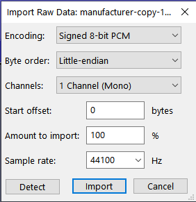

# alifeee screws with audio

Playing around with audio files. Mainly [PCM](https://en.wikipedia.org/wiki/Pulse-code_modulation) (Pulse Code Modulation) files, which are just raw audio bytes (samples).

PCM files need metadata to be useful, i.e., Encoding (signed/unsigned, 8/16/etc bits), byte order (big/little endian), channels, sample rate (e.g., 44 kHz).



## `MP3` → `PCM`

You can use FFmpeg with the format/encoding "s16le" (signed-16bit-littleendian):

```bash
ffmpeg -i in.mp3 -y -f s16le -c:a:1 pcm_s16le out.pcm
```

To list format/codecs, use

```bash
ffmpeg -formats | grep "PCM"
ffmpeg -codecs | grep "PCM"
```

## `PCM` → `MP3`

Using [lame](https://linux.die.net/man/1/lame),

The following command writes an `mp3` file with:

- 44.1khz sampling
- 2 bytes (16 bit) per sample
- little endian bit order
- mono audio mode

```bash
lame -r -s 44.1 --bitwidth 16 --little-endian -m m out.pcm
```
