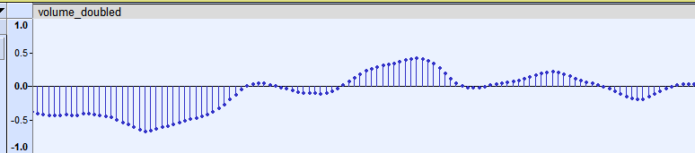

# alifeee screws with audio

Playing around with audio files. Mainly [PCM](https://en.wikipedia.org/wiki/Pulse-code_modulation) (Pulse Code Modulation) files, which are just raw audio bytes (samples).

In my simple imagination, they are just a list of bytes, representing samples (for mono audio).



PCM files need metadata to be useful, i.e., Encoding (signed/unsigned, 8/16/etc bits), byte order (big/little endian), channels, sample rate (e.g., 44 kHz).


## `MP3` → `PCM`

You can use FFmpeg with the format/encoding "s16le" (signed-16bit-littleendian):

```bash
ffmpeg -i in.mp3 -y -f s16le -c:a:1 pcm_s16le out.pcm
```

To list format/codecs, use

```bash
ffmpeg -formats | grep "PCM"
ffmpeg -codecs | grep "PCM"
```

## `PCM` → `MP3`

Using [lame](https://linux.die.net/man/1/lame),

The following command writes an `mp3` file with:

- 44.1khz sampling
- 2 bytes (16 bit) per sample
- little endian bit order
- mono audio mode

```bash
lame -r -s 44.1 --bitwidth 16 --little-endian -m m out.pcm
```

## Screwing with audio

Here begin the experiments. I mainly use Lua to screw with the raw audio data. Here are some examples. See the rest in the filesystem

| file | what it does |
| --- | --- |
| [`bitrate_halfer.lua`](./bitrate_halfer.lua) | This halves the audio bitrate. The way I do it is reading the file, and only writing every other byte to the output. |
| [`volume_doubler.lua`](./bitrate_halfer.lua) | This doubles the audio volume. The way I do it is reading the file, and writing each byte with value * 2. They will be truncated if they start too loud (i.e., half max volume). |
| [`signal_averager.lua`](./signal_averager.lua) | This takes a rolling median of the audio signal. It mainly makes things sound super muffled |

To do the whole process at once (screw with audio and turn into mp3), you can use a command similar to this:

```bash
cat out.pcm | lua signal_averager.lua │ lame -r -s 44.1 --bitwidth 16 --little-endian -m m "-" out_modified.mp3
```

## Converting files to audio

There is no reason the file has to *start* life as an audio file. For example, what does this GitHub page sound like?

```bash
curl https://github.com/alifeee/audio-experiments | lua signal_averager.lua 50 | lame -r -s 44.1 --bitwidth 16 --little-endian -m m "-" github.mp3
```

We can play with the sample rate and bit width to make it sounds more "underwater-y":

```bash
curl https://github.com/alifeee/audio-experiments | lua signal_averager.lua 50 | lame -r -s 1 --bitwidth 8 --little-endian -m m "-" github.mp3
```

or "machine-gun-y":

```bash
curl https://github.com/alifeee/audio-experiments | lame -r -s 15 --bitwidth 8 --little-endian -m m "-" github.mp3
```

What does this README sound like?

```bash
curl https://raw.githubusercontent.com/alifeee/audio-experiments/main/README.md | lua signal_averager.lua 50 | lame -r -s 1 --bitwidth 8 --little-endian -m m "-" readme.mp3
```

Truly the possibilities are endless.
